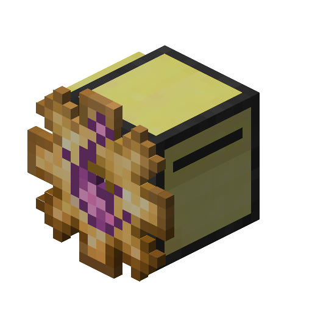

# End automata

Advanced automata that can harness power of the End.

!!! picture inline end
    { align=right }

## Supported APIs

- [Configuration API](../api/configuration.md)
- [Fuel API](../api/fuel.md)
- [Operation API](../api/operation.md)
- [Look API](../api/look.md)
- [Interaction API](../api/interaction.md): only interaction with blocks are allowed
- [Scan API](../api/scan.md): only interaction with items are allowed
- [Warp API](../api/warp.md)
- [Capture API](../api/capture.md): only interaction with blocks are allowed
