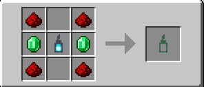
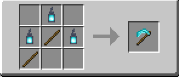
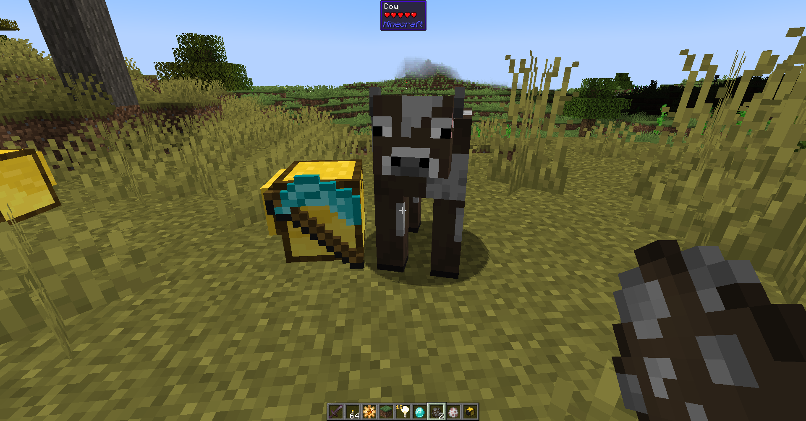

# Turtlematic

Turtlematic - is mod about making turtles so useful, so you will never need any other automation mod!

Most of peripheral methods are collected into API methods. Every new automata core, that you will craft expand or evolve those abilities by methods and parameters will stay the same!

## Current features list

With this mod turtles will be able to:

- Simulate player right and left click with items on blocks and mobs
- Capture and release blocks and mobs
- Teleporting to previously stored points in world
- Placing chat bubbles on top of themself
- Searching for mobs or items around turtle

and more feature comes

## Getting started

!!! picture inline end
    { align=right }

    Soul vial recipe

To start with the main part of this mod, you need to obtain a Soul vial and start gathering souls. To collect soul you just need to right click on soul sand with this vial, it consumes soul and transform soul sand into usual sand. You can track soul consumption progress by tooltip and image picture. After enough soul it will be transformed into "Filled soul vial" that can be used to craft your first [automata](automata/automata.md)!

## Improving automata core

!!! picture inline end
    { align=right }

    Soul scrapper recipe

Crafted automata core is just the first step. To improve it you need a tool, that will allow to you to collect souls and infuse your automata core with it. This tool is called [Soul Scrapper](./miscellaneous/soul_scrapper.md). Terrifying scythe that are too evil to be used by human hand. Thankfully, you can use turtles for this dirty and evil job.

  

!!! picture inline
    { align=left }

    Poor cow

At [automata](automata/automata.md) page you can see cores, that can be created from base one.
